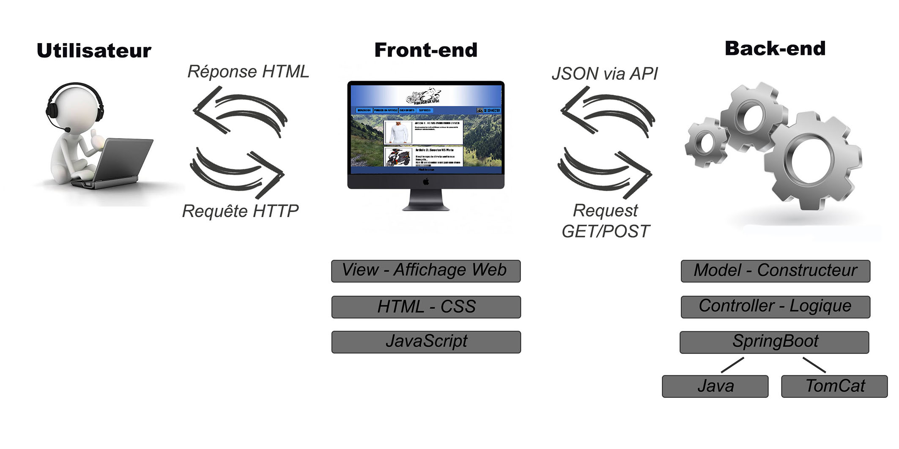
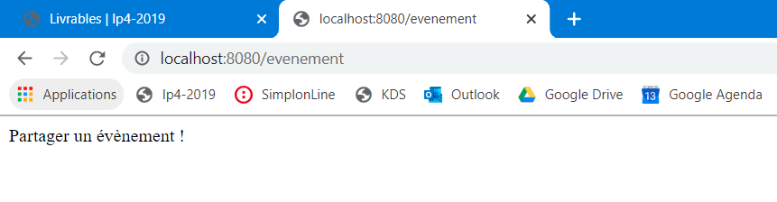

<h1>Projet Fullstack</h1>


<h2>Fil Rouge - RoadBookRide - Partager un évènement</h2>

<p>J'ai profité de ce nouveau projet pour réaliser une petite partie du projet Fil Rouge.</p>
<p>Notre projet Fil Rouge sera composé de plusieurs pages dont une, qui permettra aux internautes de publier des évenements, tels que des rassemblements moto, des bourses d'échanges et bien plus encore...
<br>C'est donc à cette page que j'ai consacré mon projet Fullstack !</p>

<h1>Diagramme du projet</h1>



<h1>Liste des Endpoint de mon application</h1>


```java 
@RequestMapping("/evenement")
```


