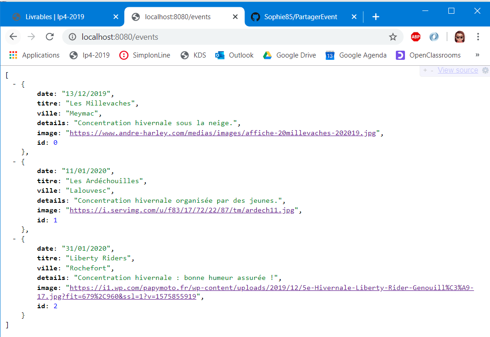
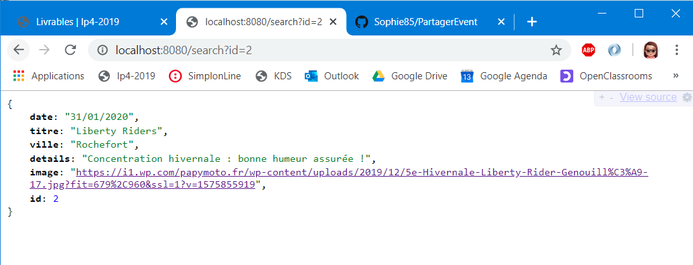
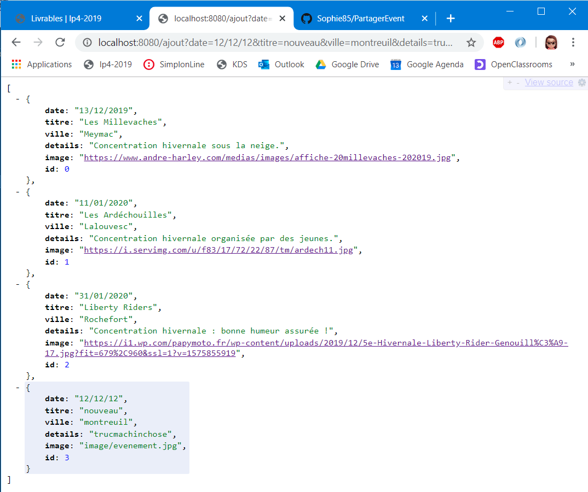
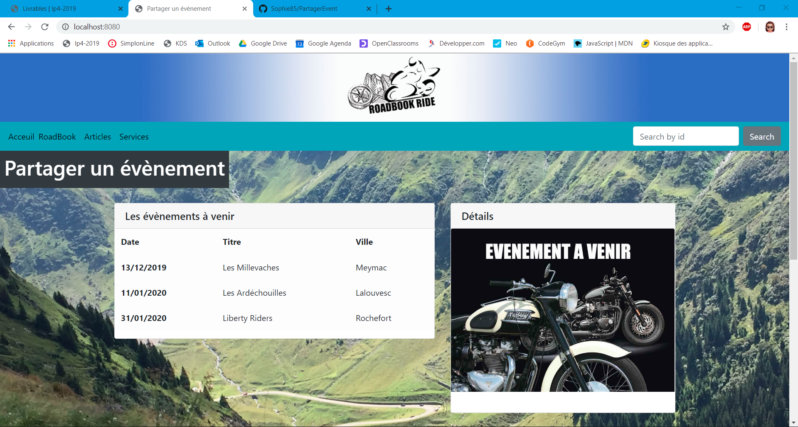
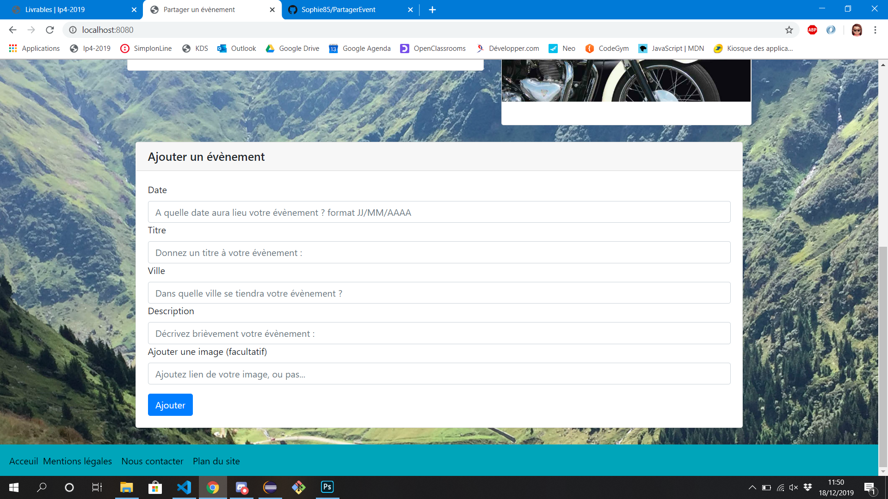

<h1>Projet Fullstack</h1>


<h2>Fil Rouge - RoadBookRide - Partager un évènement</h2>

<p>J'ai profité de ce nouveau projet pour réaliser une petite partie du projet Fil Rouge.</p>
<p>Notre projet Fil Rouge sera composé de plusieurs pages dont une, qui permettra aux internautes de publier des évenements, tels que des rassemblements moto, des bourses d'échanges et bien plus encore...
<br>C'est donc à cette page que j'ai consacré mon projet Fullstack !</p>

<h1>Diagramme du projet</h1>


<h1>Liste des endpoint de mon application</h1>
<h2>Premier endpoint</h2>
<p>Permet d'afficher un message</p>

```java 
@RequestMapping("/evenement")
public String partagerEvenement() {
		return "Partager un évènement !";
	}
```


<h2>Deuxième endpoint</h2>
<p>Permet d'afficher la liste des objets créés</p>

```java
@RequestMapping("/events")
	public List<Evenement> getEvenementList() {

		return eventList;
	}
```


<h2>Troisième endpoint</h2>
<p>Permet de faire une recherche par id dans la liste d'objets</p>

```java
@RequestMapping("/search")
	public ResponseEntity<Evenement> getEvenement(@RequestParam(value = "id") int id) {
		for (Evenement evenement : eventList) {
			if(evenement.getId() == id)
				return ResponseEntity.ok(evenement);
		}
		return ResponseEntity.notFound().build();
	}
```


<h2>Quatrième endpoint</h2>
<p>Permet d'ajouter un objet dans la liste</p>

```java
@RequestMapping("/ajout")
	public List<Evenement> addEvent(
			@RequestParam(value = "date") String date, 
			@RequestParam(value = "titre") String titre, 
			@RequestParam(value = "ville") String ville, 
			@RequestParam(value = "details") String details, 
			@RequestParam(defaultValue = "image/evenement.jpg",
			value = "image") String image){
		eventList.add(new Evenement(date, titre, ville, details, image));
		
		return eventList;
    }
```


<h2>Cinquième endpoint</h2>
<p>Pour renvoyer vers le template 404.html</p>

```java
 @GetMapping("/error")
    public String handleError(HttpServletRequest request) {
        return "404";
    }
```


<h1>Capture d'écran du projet</h1>
<h2>Haut</h2>



<h2>Bas</h2>



<h1>Remerciements</h1>
<p>Un grand merci à Virgile pour son aide et sa patience...</p>